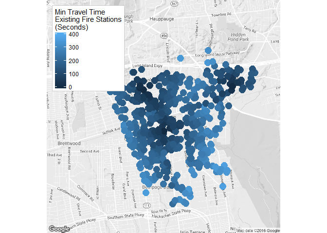
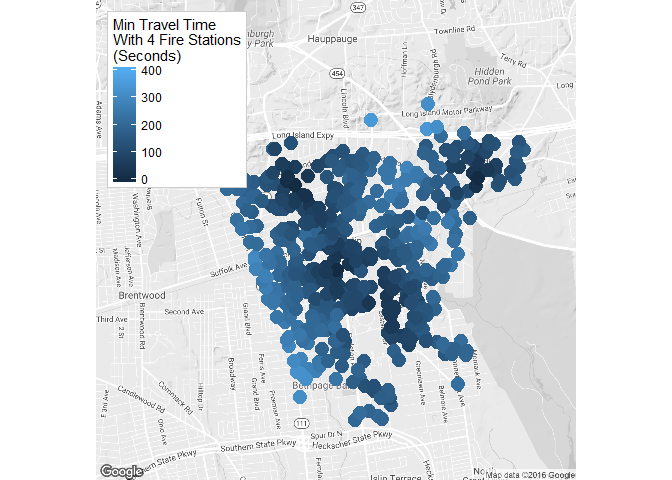
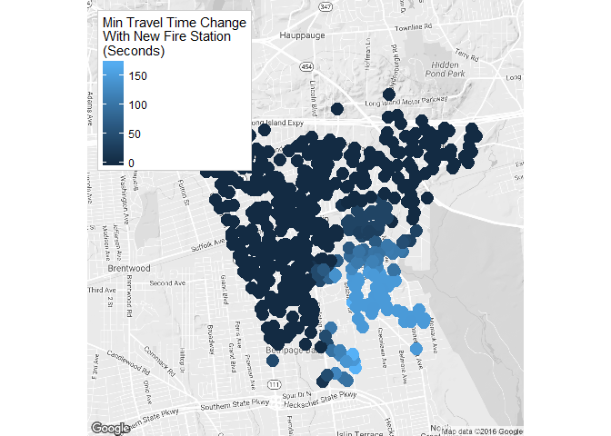

BuildMapImages
================
Dan Murphy
August 11, 2016

The goal of the maps shown below is to indicate how the minimum travel time for a fire engine will change after construction of a new fire station.

``` r
library(ggmap)
library(dplyr)
```

First, the minimum travel time is calculated under the existing scenario with three fire stations and then again after construction of the new fire station.

``` r
LocationsDF$SecondsFromMain <- as.numeric(levels(LocationsDF$SecondsFromMain))[LocationsDF$SecondsFromMain]
LocationsDF$SecondsFromSta2 <- as.numeric(levels(LocationsDF$SecondsFromSta2))[LocationsDF$SecondsFromSta2]
LocationsDF$SecondsFromSta3 <- as.numeric(levels(LocationsDF$SecondsFromSta3))[LocationsDF$SecondsFromSta3]
LocationsDF$SecondsFromSta4 <- as.numeric(levels(LocationsDF$SecondsFromSta4))[LocationsDF$SecondsFromSta4]

LocationsDF <- LocationsDF %>% rowwise() %>% mutate(MinTravelExistingFireStations= 
                                                    min(SecondsFromMain,SecondsFromSta2,SecondsFromSta3))
LocationsDF <- LocationsDF %>% rowwise() %>% mutate(MinTravelw4FireStations = 
                                                    min(SecondsFromMain,SecondsFromSta2,
                                                        SecondsFromSta3,SecondsFromSta4))
```

``` r
CI_Map <- qmap("Central Islip, New York", zoom=14, color="bw", legend="topleft")
```

    ## Map from URL : http://maps.googleapis.com/maps/api/staticmap?center=Central+Islip,+New+York&zoom=14&size=640x640&scale=2&maptype=terrain&language=en-EN&sensor=false

    ## Information from URL : http://maps.googleapis.com/maps/api/geocode/json?address=Central%20Islip,%20New%20York&sensor=false

``` r
MapLocationsDF.Alarms <- LocationsDF %>% filter(MinTravelExistingFireStations<500)

CI_Map + geom_point(aes(x=lon, y=lat, colour=MinTravelExistingFireStations,size=2), 
                    data=MapLocationsDF.Alarms) + 
                    theme(legend.position=c(.15,.35)) + 
                    labs(colour = "Min Travel Time\nExisting Fire Stations\n(Seconds)") + 
                    guides(size=FALSE)
```

    ## Warning: Removed 189 rows containing missing values (geom_point).

<!-- -->

``` r
CI_Map + geom_point(aes(x=lon, y=lat, colour=MinTravelw4FireStations, size=2), 
                    data=MapLocationsDF.Alarms) + 
                    theme(legend.position=c(.15,.35)) + 
                    labs(colour = "Min Travel Time\nWith 4 Fire Stations\n(Seconds)") + 
                    guides(size=FALSE)
```

    ## Warning: Removed 189 rows containing missing values (geom_point).

<!-- -->

This last map shows the change in travel times resulting from the new station.

``` r
MapLocationsDF.Alarms$MinTravelChange <- MapLocationsDF.Alarms$MinTravelExistingFireStations - 
                                         MapLocationsDF.Alarms$MinTravelw4FireStations

CI_Map + geom_point(aes(x=lon, y=lat, colour=MinTravelChange,size=2), 
                    data=MapLocationsDF.Alarms) + 
                    theme(legend.position=c(.15,.35)) + 
                    labs(colour = "Min Travel Time Change\nWith New Fire Station\n(Seconds)") +     
                    guides(size=FALSE)
```

    ## Warning: Removed 189 rows containing missing values (geom_point).

<!-- -->
