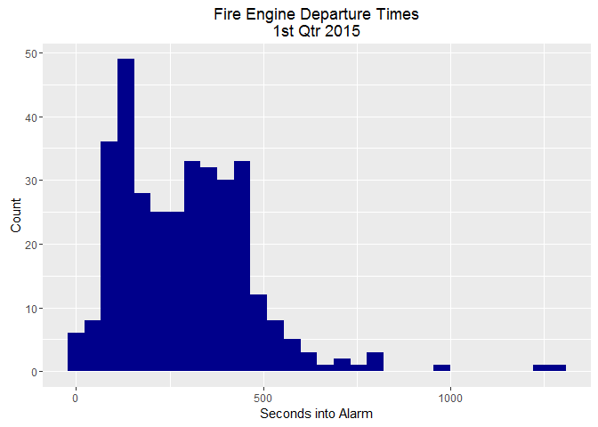
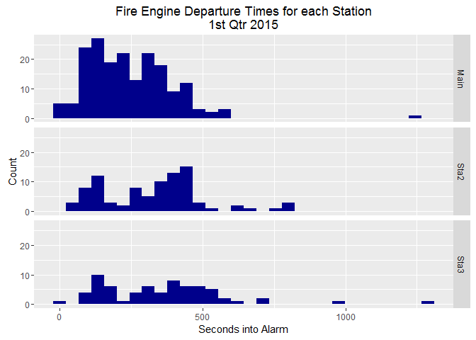
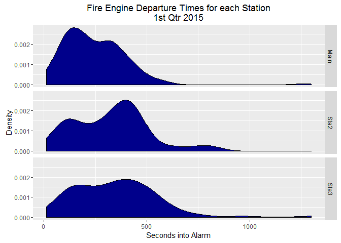
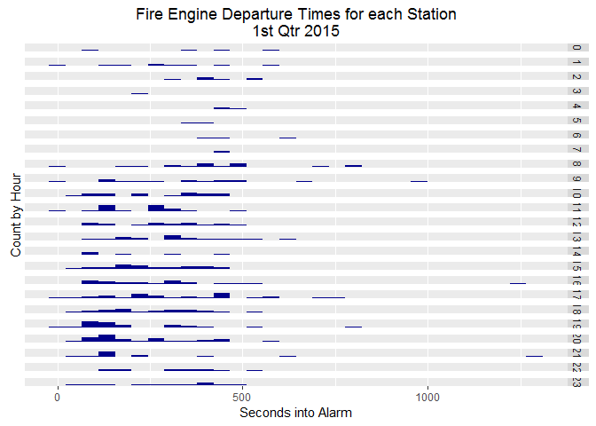

ModelDesign
================
Dan Murphy
August 10, 2016

``` r
library(dplyr)
library(tidyr)
library(ggplot2)
library(lubridate)

load(file="StationFirstSig2Long.RData")
```

The simulation model featured two random variables. The first random variable determines when a fire engine leaves the station. A second determines how quickly the engine travels to the alarm.

The fire department is staffed by volunteers who are not always present at the fire station. This results in a bimodal distribution of fire engine departures with a first bump where members are already present in the station and a second when members need to respond to the station.

``` r
ggplot(StationFirstSig2.Long, aes(x=Signal2Times)) + 
      geom_histogram(fill="dark blue") + 
      ggtitle("Fire Engine Departure Times\n 1st Qtr 2015 ") + 
      labs(x="Seconds into Alarm", y="Count")
```

<!-- -->

Several facets were looked at to determine where the shape of this distribution changes. The following graphs provided evidence that complications to the model were warranted. This first graph shows a greater number of departures from Station 1 when compared to Station 2 and 3. As a result, in the model fire engines only depart a portion of the alarms as reflected here.

``` r
ggplot(StationFirstSig2.Long, aes(x=Signal2Times)) + 
      geom_histogram(fill="dark blue") +
      facet_grid(Station ~ .) + 
      ggtitle("Fire Engine Departure Times for each Station\n 1st Qtr 2015 ") + 
      labs(x="Seconds into Alarm", y="Count")
```

<!-- -->

This same facet is applied with a probability desnity function to show Stations 2 and 3 dispatch more engines in the 2nd cluster of departures. In the model, Station 1 will use a distribution with a larger primary cluster. Stations 2 and 3 utlizite a distribution with a smaller primary cluster.

``` r
ggplot(StationFirstSig2.Long, aes(x=Signal2Times)) + 
      geom_density(fill="dark blue") +
      facet_grid(Station ~ .) + 
      ggtitle("Fire Engine Departure Times for each Station\n 1st Qtr 2015 ") + 
      labs(x="Seconds into Alarm", y="Density")
```

<!-- -->

The last modification needed to the engine departure component of the model is seen after faceting the histogram by time of day. Between the hours of 2 a.m. and 6 a.m., the primary cluster of departures disappears for all fire stations.

``` r
ggplot(StationFirstSig2.Long, aes(x=Signal2Times)) + 
      geom_histogram(fill="dark blue") +
      facet_grid(Hour ~ .) + 
      ggtitle("Fire Engine Departure Times for each Station\n 1st Qtr 2015 ") + 
      labs(x="Seconds into Alarm", y="Count by Hour") +
      scale_y_continuous(breaks=c())
```

<!-- -->
